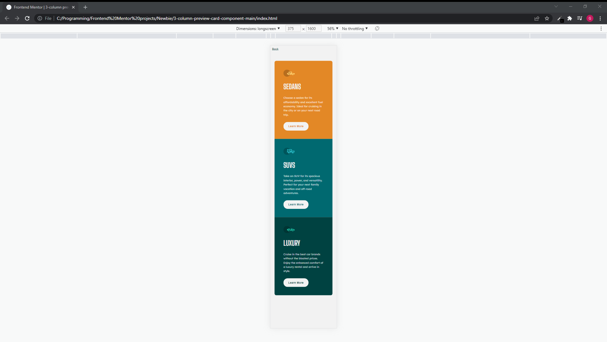
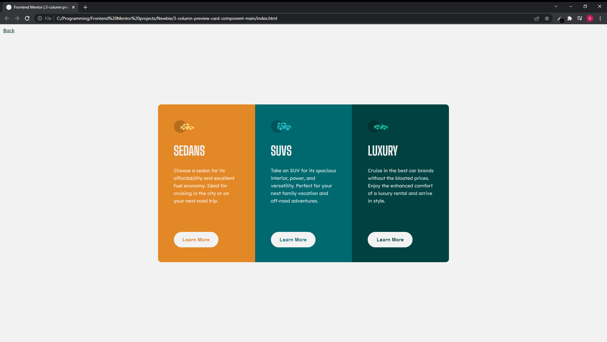
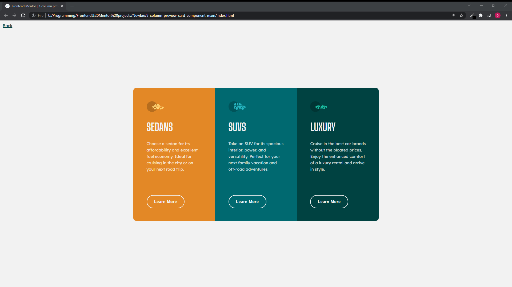

# Frontend Mentor - 3-column preview card component solution

This is a solution to the [3-column preview card component challenge on Frontend Mentor](https://www.frontendmentor.io/challenges/3column-preview-card-component-pH92eAR2-). Frontend Mentor challenges help you improve your coding skills by building realistic projects.

## Table of contents

- [Overview](#overview)
  - [The challenge](#the-challenge)
  - [Screenshot](#screenshot)
  - [Links](#links)
- [My process](#my-process)
  - [Built with](#built-with)
  - [What I learned](#what-i-learned)
  - [Continued development](#continued-development)
  - [Useful resources](#useful-resources)
- [Author](#author)
- [Acknowledgments](#acknowledgments)

## Overview

### The challenge

Not too challenging.

### Screenshot

### Links

This project:

https://gareth-moore.github.io/Frontend-Mentor-projects/Newbie/stats-preview-card-component-main/index.html

All my projects:

https://gareth-moore.github.io/Frontend-Mentor-projects/

## My process

- My process with this was similar to the previous couple of challenges. First I download all the files and read through everything I need to do.
- I organize my folders by creating a notes.md file and creating a new git repository. Just open everything up really. Not complicated.
- I then get started on the simple stuff like fetching the fonts, writing up the semantic HTML and preparing my css style sheet.
- Then the hard work begins. I style my css mobile-first. I find this is the easiest way as mobile is pretty simple normally. This means that the mobile styles can be sorted out quickly and you can start (almost) fresh with a media queries portion for the desktop view. I start work from the outside in with some, but usually minor, changes in the HTML. If I can't go in, I go down.
- when I am finished styling and I am happy with my work I refactor my code and add any additional semantic markup or descriptions that would be necessary. I try to ask myself, as I ambulate the halls of my code: will this QUICKLY make sense to me if I come back to it in a year? To the best of my ability I have my code clearly organized and easy to understand with enough descriptions to be easily understood but not enough to be verbose and tedious.
- then I finish this README.md and push my changes to Github and poof! I'm done! Then off to FEM to upload there and await feedback. I may have a croissant and coffee while I wait but normally I just go do something else.

### Built with

- Semantic HTML5 markup
- CSS custom properties
- Flexbox
- Mobile-first workflow
- Pixel Perfect Pro (Firefox extension for overlaying an image on the website)

### What I learned

During this project I felt like I didn't learn any hard skills but rather soft skills. Things like don't sweat the small stuff, gerrymander the system to get what you need from it, there is more than one way to do something, and sometimes you just have to accept a loss and move on because it's just wasting your most precious of resources, time.

But here are some things I learned:
- I learned the difference between `inline`, `inline-block` and `block`. `inline` elements stack horizontally and **CANNOT** have width and height properties. `inline-block` elements stack horizontally and **CAN** have width and height properties. `block` elements stack vertically and **CAN** have a width and height property. **NB** `block` elements have `width: 100%;` by default so their width will be the same as their partent container.
- The above point helped me to realise that the reason my `img` was not fitting nicely in the `div` I was using is because I couldn't actually set the width and height. I was so confused as to why it wasn't working. Alas I changed it to `block` and bam it worked perfectly. I think this is important because I, and probably more, thought that an `img` tag was a `block` element.
- You can achieve a variety of image blending effects by using a background image and an `img` (using the same picture for each). This is because `background-image` can use `background-blend-mode` to add effects. Also the `img` element can use `filter` to add effects. Thus you can layer an `img` over a `div` that has the same picture as the `img` for the `background-image` element. If you size the `div` according to the `img` then the `background-image` will be exactly the same size so it will line up perfectly. Then you can add 2 layers of effects. One for `background-image` and another for `img`.
- The above point mentioned it but I'll describe it more. If you want to have the `background-image` have effects you may struggle to size the containing element because the `background-image` won't change the height or width of the container. So you can basically add an `img` and use it's width and height properties to size the container but hide the `img` so you can see the `background-image` with the effects. Simply use `visibility: hidden;`. **NB** Do not use `display: none;` as this will remove the `img` and the yearned-for sizing properties with it!
- I discovered Pixel Perfect Pro (Firefox extension) which overlays an image ontop of the website. So you can adjust your styling like you had a stencil.
- Looking at other developers work on FEM I realized that it is very important to ingrain a healthy amount of readability and organization to your code. I have spent a bit of time coming up with some techniques like catagorizing my code, having a rough order for example: font information first, sizing next, layout/positioning/display after and everything that isn't one of those last like `background-color` or `border-radius`.

### Continued development

I've written about this a couple times now. Basically a few more FE mentor projects. When I am comfortable with HTML, CSS and JS then more on to React and all sorts of tech. I also decided to add a photo editing course to my list of things to do because this challenge irked me something fierce when it came down to making the colours of the image match the template.

### Useful resources

- MDN
- W3Schools
- CSS-Tricks
- Pixel Perfect Pro
- GIMP photo editing software
- ColorZilla
- [Inline vs Inline-Block vs Block](https://www.samanthaming.com/pictorials/css-inline-vs-inlineblock-vs-block/)

## Author

- Website - [Gareth Moore](https://gareth-moore.github.io/Frontend-Mentor-projects/)
- Frontend Mentor - [@Gareth-Moore](https://www.frontendmentor.io/profile/Gareth-Moore)

## Acknowledgments

I would like to thank all the people and organizations that make material available online for free for people like me to use. Thank you Front End Mentor for providing this challenge for me, it is much appreciated! Front End Mentor user @melwynt who suggested some helpful resources! Thanks a ton!
