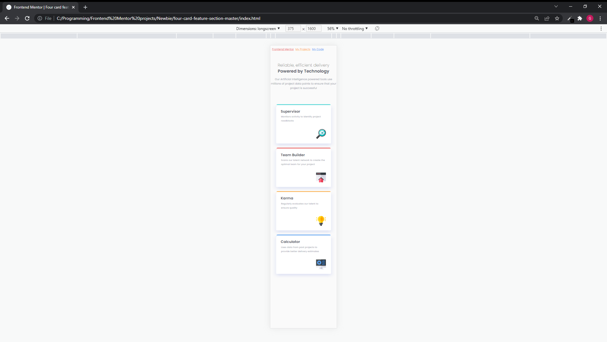
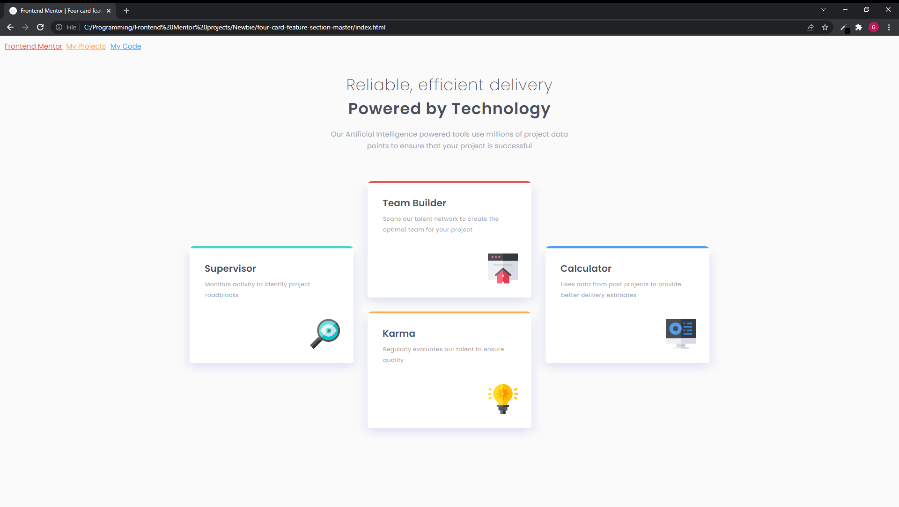

# Frontend Mentor - Four card feature section solution

This is a solution to the [Four card feature section challenge on Frontend Mentor](https://www.frontendmentor.io/challenges/four-card-feature-section-weK1eFYK). Frontend Mentor challenges help you improve your coding skills by building realistic projects.

# Table of contents

- [Overview](#overview)
  - [Screenshot](#screenshot)
  - [Links](#links)
- [My process](#my-process)
  - [Built with](#built-with)
  - [What I learned](#what-i-learned)
  - [Useful resources](#useful-resources)
- [Author](#author)
- [Acknowledgments](#acknowledgments)

# Overview

### Screenshot

### Links

This project:

https://github.com/Gareth-Moore/Frontend-Mentor-projects/tree/master/Newbie/four-card-feature-section-master

All my projects:

https://gareth-moore.github.io/Frontend-Mentor-projects/

# My process

- My process with this was similar to the previous couple of challenges. First I download all the files and read through everything I need to do.
- I organize my folders by creating a notes.md file and creating a new git repository. Just open everything up really. Not complicated.
- I then get started on the simple stuff like fetching the fonts, writing up the semantic HTML and preparing my css style sheet.
- Then the hard work begins. I style my css mobile-first. I find this is the easiest way as mobile is pretty simple normally. This means that the mobile styles can be sorted out quickly and you can start (almost) fresh with a media queries portion for the desktop view. I start work from the outside in with some, but usually minor, changes in the HTML. If I can't go in, I go down.
- when I am finished styling and I am happy with my work I refactor my code and add any additional semantic markup or descriptions that would be necessary. I try to ask myself, as I ambulate the halls of my code: will this QUICKLY make sense to me if I come back to it in a year? To the best of my ability I have my code clearly organized and easy to understand with enough descriptions to be easily understood but not enough to be verbose and tedious.
- then I finish this README.md and push my changes to Github and poof! I'm done! Then off to FEM to upload there and await feedback. I may have a croissant and coffee while I wait but normally I just go do something else.

### Built with

- Semantic HTML5 markup
- CSS custom properties
- Flexbox
- Mobile-first workflow
- Pixel Perfect Pro (Firefox extension for overlaying an image on the website)

### What I learned

This challenge was extremely tedious when it came down to making the site look exactly like the preview. I am beginning to think I should just get the big stuff down and not worry about the small little details because I am wasting so much time on it. But it's hard to ignore haha!

### Useful resources

- MDN
- W3Schools
- CSS-Tricks
- Mozzila Firefox and Chrome
- Pixel Perfect Pro

# Author

- Website - [Gareth Moore](https://gareth-moore.github.io/Frontend-Mentor-projects/)
- Frontend Mentor - [@Gareth-Moore](https://www.frontendmentor.io/profile/Gareth-Moore)

# Acknowledgments

I would like to thank all the people and organizations that make material available online for free for people like me to use. Thank you Front End Mentor for providing this challenge for me, it is much appreciated!
