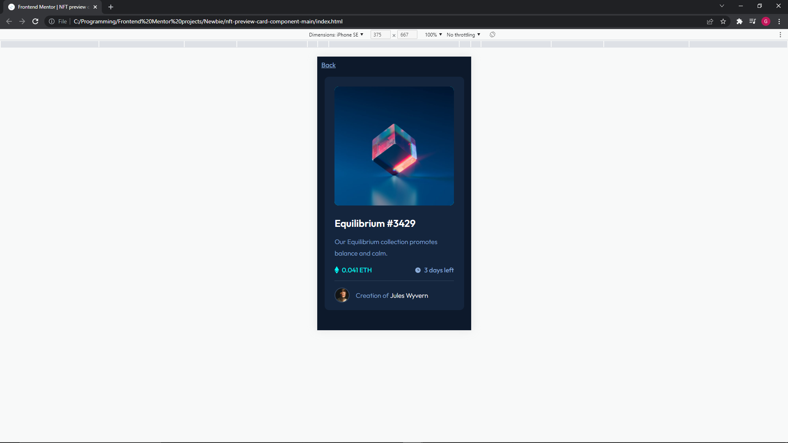
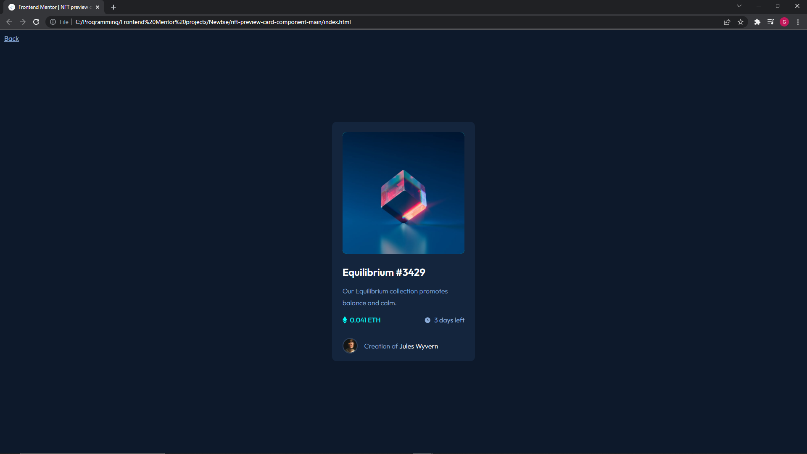

# Frontend Mentor - NFT preview card component solution


This is a solution to the [NFT preview card component challenge on Frontend Mentor](https://www.frontendmentor.io/challenges/nft-preview-card-component-SbdUL_w0U). Frontend Mentor challenges help you improve your coding skills by building realistic projects.

## Table of contents

- [Overview](#overview)
  - [The challenge](#the-challenge)
  - [Screenshot](#screenshot)
  - [Links](#links)
- [My process](#my-process)
  - [Built with](#built-with)
  - [What I learned](#what-i-learned)
  - [Continued development](#continued-development)
  - [Useful resources](#useful-resources)
- [Author](#author)
- [Acknowledgments](#acknowledgments)

## Overview

### The challenge

To recreate the NFT cart using HTML and CSS.

### Screenshot




### Links

This project:

https://gareth-moore.github.io/Frontend-Mentor-projects/Newbie/nft-preview-card-component-main/

All my projects:

https://gareth-moore.github.io/Frontend-Mentor-projects/

## My process

**Note: During the process I keep a notes.txt file open and jot down anything I find interesting or useful, as well as documenting the process.**

My process begins with sorting out what I need to do and understanding what is required. I read through all the material first and take a look at the styling guide. Once I know the details about what I need to create then I go to the next step.

I flesh out as much of the HTML as I can before I begin any styling. In this case I started with the relavent text/copy and just had to add semantic markup to provide the structure for the page. This includes importing the fonts, linking stylesheets etc.

The next step is to add styling to the HTML. I start from the top down. In this case it was a card so I started from the top of the card and worked my way down. I separated my CSS into 3 main catagories: Typography, Layout and Components. I would move from catagories frequently to get the look I wanted.

Once the page is complete and looking exactly how I want it to I go back and refactor my code as best as I can to organize and optimize it.

The last thing I do is take screenshots of the completed project, update the readme and publish it!

### Built with

- Semantic HTML5 markup
- CSS custom properties
- Flexbox
- Mobile-first workflow

### What I learned

Firstly, this was quite a challenge and I learned a lot of things. Some very small tid bits but other, rather intensive, information. In no particular order, here goes:

- When styling an hr element keep in mind that the line is created with the hr element's border property. So either change the border color, thickness etc or give the hr height and change the background color etc.
- I started implementing a lot more classes. I am a bit concerned about when to use classes because I think it may look more complicated than it needs to be. But also it is descriptive and each class provides some information about which element I am refering to. Overall I found it more enjoyable and perspicious, but more time consuming, to use more classes.
- When trying to vertically align inline-block elements you can use verticle-align: middle so that the elements line up. E.g. an icon and label that are off-centered can be infuriating, this is a nice solution.
- A design trick: use contrast to make lines appear thinner or thicker. Try a dark background with a dull grey line and it will make it appear much thinner than a white line while giving the illusion that the line is white.
- SVGs can be added via the  tag which is nice.
- Change mouse pointers by using the cursor: property. E.g cursor: grab;
- This one is a big one and the biggest hurdle I faced in this challenge. Trying to center the SVG ontop of the <div> element with a position: absolute; property. I ended up using:
```css
.svg {
  position: absolute;
  top: 50%;
  left: 50%;
  transform: translate(50%, -50%);
}
```
**Note: You may need to mess around with the translate values, either positive or negative. I was stuck there for ages before I realised I needed (50%, -50%) and not (-50%, -50%)**
- I also learned a fair amount about transitions which was so much fun! I am still fleshing this one out but when you add opacity to a layer you change the z-index somehow. You need to add a positon: property to the thing you are trying to change as well as being aware the z-index can be a bit finicky. I don't fully understand it yet but I am going to get more practice soon I bet! Transitions are still a bit of a mystery to me.
- Changing the default font-size: 62.5%; makes it so that 1rem is equal to 10px. Which is pretty handy and makes using rems for responsive design much easier as you know the measurements. Unless you are just ace at maths and want to convert form 1rem to 16px then be my guest! :) You can then set the default text size to 1.6 rems so the text won't be different to normal.
- Reminder that somehow, someway you have to remember not to be an idiot. I spent a good 15 minutes wondering why my icons had gone rogue just to figure out that (when changing class names) I hadn't saved the HTML file... FML!
- Random tid bit of the day. Apparently detecting zoom levels on a browser is either hard, complicated or impossible.

### Continued development

My best course of action is to pick up another Front End Mentor challenge and have at it! I have enjoyed slowing down this process and doing everything well. From taking notes, to refactoring code to patiently learning new things. I am particularly interested in learning more about transitions as they are just so freaking cool when you pull them off!

I need a lot of practice with HTML, CSS and JS so that is where I will be for the next couple of weeks. But after that I will be looking into some frameworks and libraries as well as whatever drifts into my sphere of influence.

### Useful resources

I would say just the usual suspects: Stack Overflow, MDN Web Docs, W3 Schools, Kevin Powell and some others I didn't take not of. Sorry :(

## Author

- Website - [Gareth Moore](https://gareth-moore.github.io/Frontend-Mentor-projects/)
- Frontend Mentor - [@Gareth-Moore](https://www.frontendmentor.io/profile/Gareth-Moore)

## Acknowledgments

I would like to thank all the people and organizations that make material available online for free for people like me to use. Thank you Front End Mentor for providing this challenge for me, it is much appreciated!
