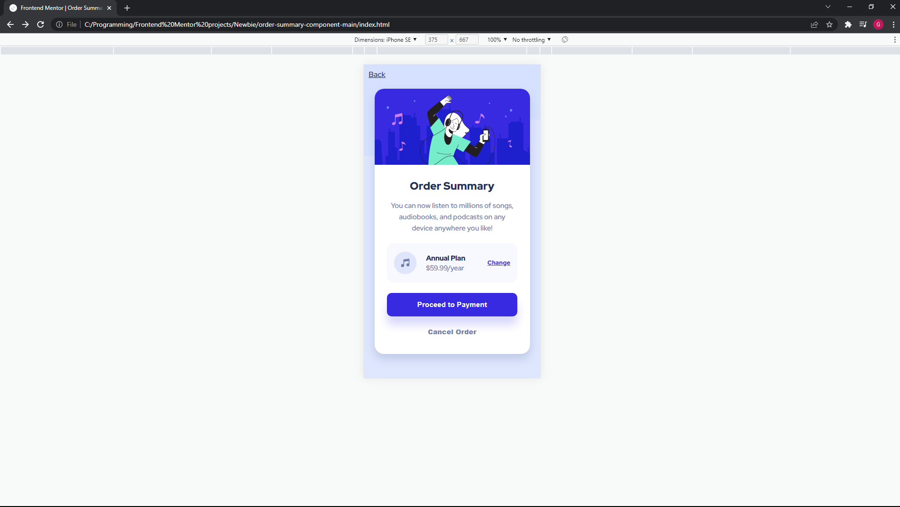
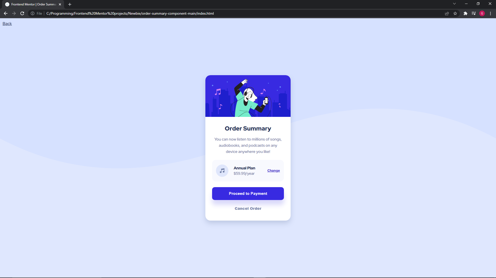
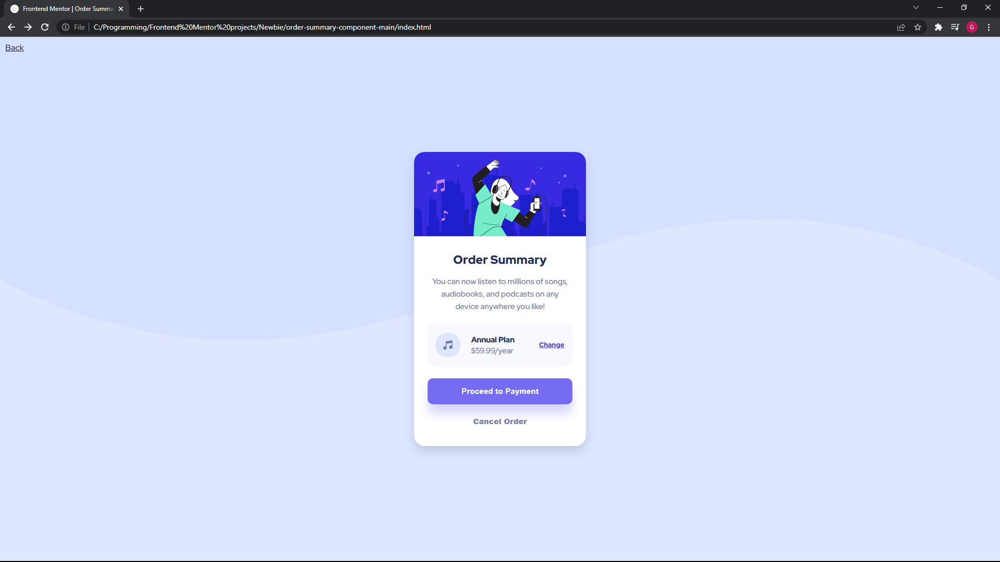

# Frontend Mentor - Order summary card solution

This is a solution to the [Order summary card challenge on Frontend Mentor](https://www.frontendmentor.io/challenges/order-summary-component-QlPmajDUj). Frontend Mentor challenges help you improve your coding skills by building realistic projects.

## Table of contents

- [Overview](#overview)
  - [The challenge](#the-challenge)
  - [Screenshot](#screenshot)
  - [Links](#links)
- [My process](#my-process)
  - [Built with](#built-with)
  - [What I learned](#what-i-learned)
  - [Continued development](#continued-development)
  - [Useful resources](#useful-resources)
- [Author](#author)
- [Acknowledgments](#acknowledgments)

**Note: Delete this note and update the table of contents based on what sections you keep.**

## Overview

### The challenge

Users should be able to:

- See hover states for interactive elements

### Screenshot





### Links

This project:

https://gareth-moore.github.io/Frontend-Mentor-projects/Newbie/order-summary-component-main/index.html

All my projects:

https://gareth-moore.github.io/Frontend-Mentor-projects/

## My process

I first start with organizing the task ahead. I figure out exactly what is required of me and set everything in order before I begin. I create the files, find the style guide and upload an initial repository to Github.

Then I start with my HTML and get that as complete as I can. Including fonts, linking stylesheets, and all HTML elements needed. I include comments as I go along.

When that is finished I start with styling. I work from the outside => in and top => bottom. If I can't go in I go down essentially. This means I start with the body and create the size and change the background. I then move on to the card itself and start with the banner image and end at the buttons at the bottom.

I spend the better part of my life trying to fine tune the colors and measurements so I don't let down the OCD gods.

Once everything is looking how I want it I quickly do the psuedoelements.

Now the site is working and ready for refactoring. I go back and orgnize my code. I try to keep it organized as I work so this is generally quite a fun little task because I like to save bits here and there and in general make my code pretty, pellucid and optimized.

Once that's done it's just some admin like taking screenshots and writing the readme. Then I post it on FEM and Slack for feedback!

### Built with

- Semantic HTML5 markup
- CSS custom properties
- Flexbox
- Mobile-first workflow

### What I learned

This project didn't teach me many new things unfortunately. But it was nice to be at a level where I didn't really have to have my hand planted firmly up Google's @$$ while I work. But I do have a few honorable mentions:

- I found that I was much quicker at getting the task organized and ready to go than before.
- I learned a little bit about first child in that:
```CSS
.myClass:first-child {}
```
Will not select the first child inside .myClass, or anything for that matter.
You will have success if you specify the element you are trying to select. Such as the p element below:
```CSS
.myClass p:first-child {}
```
- I struggled a lot eyeballing the colors from the demo pictures. I eventually started using GIMP to get the exact colors which immediately helped. It took the guess work out of the equation and I got to rest easy knowing the colors matched. **The colors in the style-guide didn't seem to have all the colors**
- I definitely learned to focus on the tiny small details and appreciate them. In this project there were some super hard to see box-shadows that I had to replicate and that took some tinkering and a lot of patience to get right (Or at least in the same area code).
- I learned a bit about time management. I can be a little OCD when it comes to making it look EXACTLY right. I need to be a little more focused on how long it is taking me. I can't get is perfect but I can get it basically the same. That's good enough. Move on and don't waste so much time stressing over minute details.

### Continued development

I've written about this a couple times now. Basically a few more FE mentor projects. When I am comfortable with HTML, CSS and JS then more on to React and all sorts of tech.

### Useful resources

I think I just used W3schools once to look up :first-child otherwise I was pretty much a lone ranger on this trip.

## Author

- Website - [Gareth Moore](https://gareth-moore.github.io/Frontend-Mentor-projects/)
- Frontend Mentor - [@Gareth-Moore](https://www.frontendmentor.io/profile/Gareth-Moore)

## Acknowledgments

I would like to thank all the people and organizations that make material available online for free for people like me to use. Thank you Front End Mentor for providing this challenge for me, it is much appreciated!
