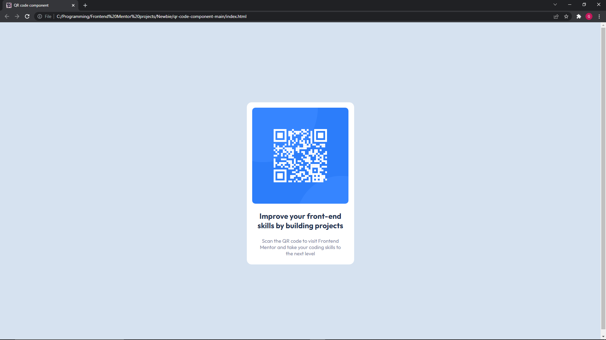

# Frontend Mentor - QR code component solution

Author - Gareth Moore https://www.frontendmentor.io/profile/Gareth-Moore

This is a solution to the [QR code component challenge on Frontend Mentor](https://www.frontendmentor.io/challenges/qr-code-component-iux_sIO_H). Frontend Mentor challenges help you improve your coding skills by building realistic projects.

# Table of contents

- [Overview](#overview)
  - [The challenge](#the-challenge)
  - [Screenshot](#screenshot)
  - [Links](#links)
- [My process](#my-process)
  - [Built with](#built-with)
  - [What I learned](#what-i-learned)
  - [Continued development](#continued-development)
  - [Useful resources](#useful-resources)
- [Author](#author)
- [Acknowledgments](#acknowledgments)

# Overview

## The challenge

To recreate the QR code card using HTML and CSS.

## Screenshot
Mobile view - ./mobileview.png
Desktop view - ./desktopview.png

## Links
Github repository - https://github.com/Gareth-Moore/Frontend-Mentor-projects/tree/master/Newbie/qr-code-component-main

# My process

## Built with
- Atom text editor
- Semantic HTML5 markup
- CSS custom properties
- Flexbox
- Mobile-first workflow

## What I learned
It took 2 days, or about 5 or 6 hours to complete this challenge. I had a good idea of how to complete this challenge before I started. I knew I would be using flex-box to center the
content on the page. It took a bit of guess work for the sizes but I got there. I learned about hsl color format and favicon.
Importantly, I learned about collapsing margins as they caused me a bit of trouble in the beginning. Additionally I learn a bit about organizing my css so I could have my code refactored
and easy to read.
All in all it was a fairly simple challenge and I am looking forward to the next one!

## Continued development
At this moment I have learned HTML, CSS and JS. But I need a lot of practice with it. I intend to practice these 3 components and then move onto React.js.

## Useful resources
I have to give a shoutout to google. Other than that I have been briefly introduced to the Slack community and it seems like a good place to learn and help others.

# Author
Frontend Mentor - (https://www.frontendmentor.io/profile/Gareth-Moore)

# Acknowledgments
To all those wonderful people who make information available online for free - thank you!
